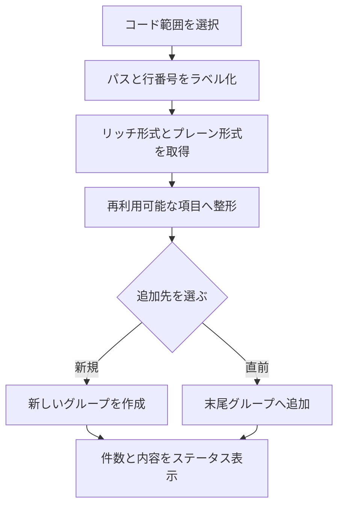
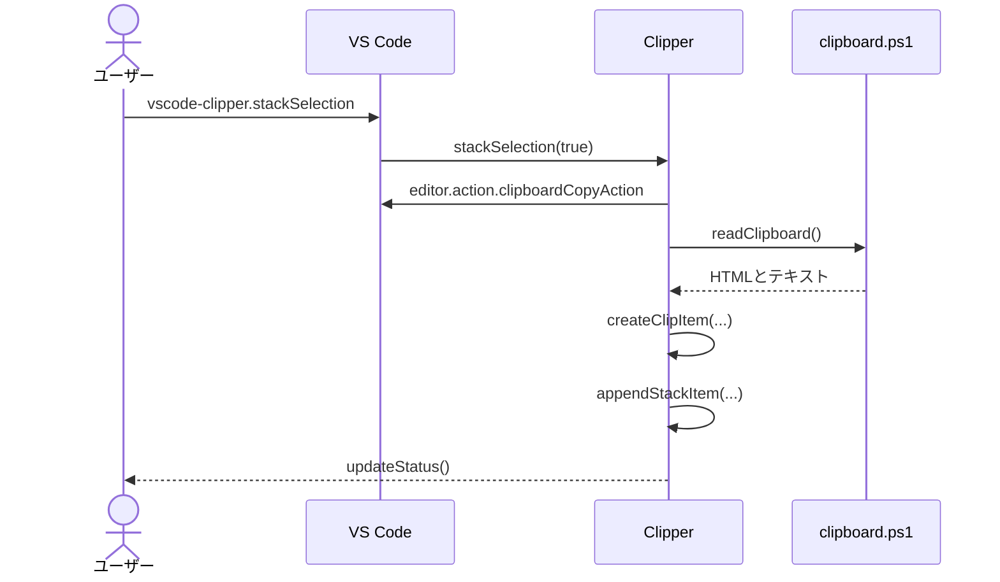

# 選択コードのスタック管理

## 概要

VS Codeで選択したコードをパス・行番号・シンタックス情報付きの項目へ変換し、後続の貼り付けやCanvas出力に使うグループ別FIFOスタックとして保持する。

## 動作フロー

## シーケンス

## 実装の構成

- **スタック操作を登録する**
  - 新規グループ追加、直前グループ追加、全消去のコマンドをVS Codeへ登録する。
  - [`src/extension.ts [203-217]`](vscode://sunb256.vscode-clipper/open?repo=vscode-clipper&path=src%2Fextension.ts&line=203) — `Clipper.register`

- **選択範囲をラベル化する**
  - アクティブな選択範囲からワークスペース相対パスと1始まりの行範囲を組み立てる。
  - [`src/extension.ts [446-483]`](vscode://sunb256.vscode-clipper/open?repo=vscode-clipper&path=src%2Fextension.ts&line=446) — `Clipper.captureSelection`, `Clipper.getDisplayPath`
  - [`src/extension.ts [93-102]`](vscode://sunb256.vscode-clipper/open?repo=vscode-clipper&path=src%2Fextension.ts&line=93) — `selectedLines`, `formatPath`

- **クリップボード形式を取得する**
  - VS Codeのコピー結果をPowerShell経由でHTMLとプレーンテキストの両形式として読み出す。
  - [`src/extension.ts [485-500]`](vscode://sunb256.vscode-clipper/open?repo=vscode-clipper&path=src%2Fextension.ts&line=485) — `Clipper.readClipboard`
  - [`helper/clipboard.ps1 [14-21]`](vscode://sunb256.vscode-clipper/open?repo=vscode-clipper&path=helper%2Fclipboard.ps1&line=14) — `get` mode

- **スタック項目を整形する**
  - パスラベルをHTML断片とテキストへ付加し、コードと言語IDを保持する項目へまとめる。
  - [`src/extension.ts [124-141]`](vscode://sunb256.vscode-clipper/open?repo=vscode-clipper&path=src%2Fextension.ts&line=124) — `createClipItem`

- **グループへ追加する**
  - 操作種別に応じて新規グループを作るか末尾グループへ項目を追加する。
  - [`src/extension.ts [79-85]`](vscode://sunb256.vscode-clipper/open?repo=vscode-clipper&path=src%2Fextension.ts&line=79) — `appendStackItem`
  - [`src/extension.ts [305-315]`](vscode://sunb256.vscode-clipper/open?repo=vscode-clipper&path=src%2Fextension.ts&line=305) — `Clipper.stackSelection`

- **状態を利用者へ示す**
  - スタック内の総件数とFIFO順の項目・グループ境界をステータスバーへ反映する。
  - [`src/extension.ts [104-113]`](vscode://sunb256.vscode-clipper/open?repo=vscode-clipper&path=src%2Fextension.ts&line=104) — `queueTooltip`
  - [`src/extension.ts [565-569]`](vscode://sunb256.vscode-clipper/open?repo=vscode-clipper&path=src%2Fextension.ts&line=565) — `Clipper.updateStatus`

## 補足

スタックは拡張機能インスタンスのメモリ内にあり、現在のVS Codeウィンドウを越えて永続化されない。
