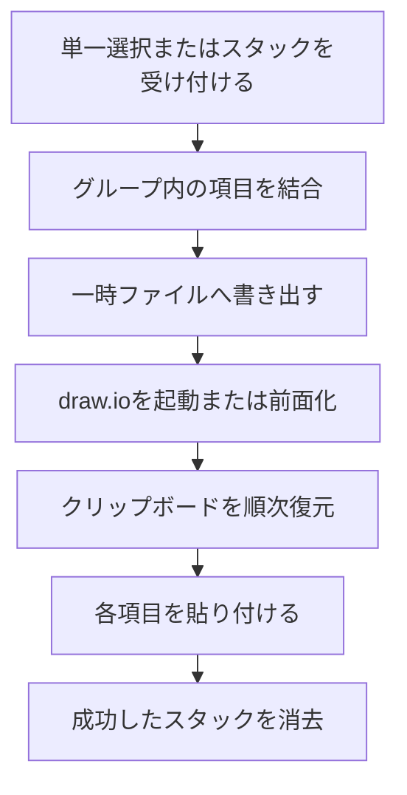
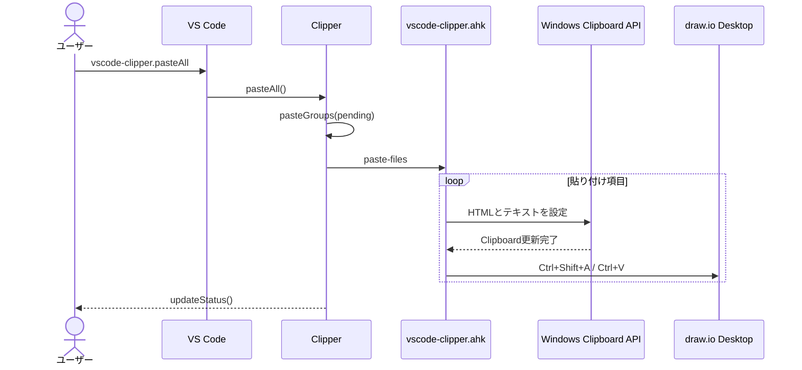

# draw.ioへの貼り付け

## 概要

選択コードまたは蓄積済みグループをリッチクリップボードデータへ変換し、Windows上のdraw.io Desktopへ順番に貼り付ける。

## 動作フロー

## シーケンス

## 実装の構成

- **貼り付け対象を確定する**
  - 単一選択は即時項目化し、スタックは処理開始時のグループ構成を複製して対象を固定する。
  - [`src/extension.ts [317-331]`](vscode://sunb256.vscode-clipper/open?repo=vscode-clipper&path=src%2Fextension.ts&line=317) — `Clipper.clipAndPaste`
  - [`src/extension.ts [351-368]`](vscode://sunb256.vscode-clipper/open?repo=vscode-clipper&path=src%2Fextension.ts&line=351) — `Clipper.pasteAll`, `Clipper.pasteStack`

- **グループを貼り付け単位へ結合する**
  - 同じグループのHTML断片とテキストを間隔付きで一つのクリップボード項目へまとめる。
  - [`src/extension.ts [115-122]`](vscode://sunb256.vscode-clipper/open?repo=vscode-clipper&path=src%2Fextension.ts&line=115) — `mergeGroup`
  - [`src/extension.ts [514-516]`](vscode://sunb256.vscode-clipper/open?repo=vscode-clipper&path=src%2Fextension.ts&line=514) — `Clipper.pasteGroups`

- **一時ファイルを準備する**
  - 各貼り付け項目のHTML形式とテキスト形式を一時ディレクトリへ対で保存する。
  - [`src/extension.ts [502-524]`](vscode://sunb256.vscode-clipper/open?repo=vscode-clipper&path=src%2Fextension.ts&line=502) — `Clipper.pasteItems`, `Clipper.writeItems`

- **draw.ioを操作する**
  - AutoHotkeyがdraw.ioを起動または前面化し、各項目をFIFO順に貼り付ける。
  - [`helper/vscode-clipper.ahk [69-99]`](vscode://sunb256.vscode-clipper/open?repo=vscode-clipper&path=helper%2Fvscode-clipper.ahk&line=69) — `PasteFiles`, `EnsureDrawio`

- **リッチクリップボードを復元する**
  - AutoHotkeyがWindows APIを呼び出し、一時ファイルからHTMLとUnicodeテキストをWindowsクリップボードへ同時設定する。
  - [`helper/vscode-clipper.ahk [101-110]`](vscode://sunb256.vscode-clipper/open?repo=vscode-clipper&path=helper%2Fvscode-clipper.ahk&line=101) — `SetClipboard`
  - [`helper/vscode-clipper.ahk`](vscode://sunb256.vscode-clipper/open?repo=vscode-clipper&path=helper%2Fvscode-clipper.ahk&line=101) — `SetClipboard`, `SetClipboardValue`

- **成功後の状態を更新する**
  - 全グループの貼り付けが完了した場合だけスタックを空にしてステータス表示を更新する。
  - [`src/extension.ts [355-367]`](vscode://sunb256.vscode-clipper/open?repo=vscode-clipper&path=src%2Fextension.ts&line=355) — `Clipper.pasteStack`

## 補足

AutoHotkey連携はWindows限定で、途中失敗時には再実行できるよう元のスタックが保持される。
