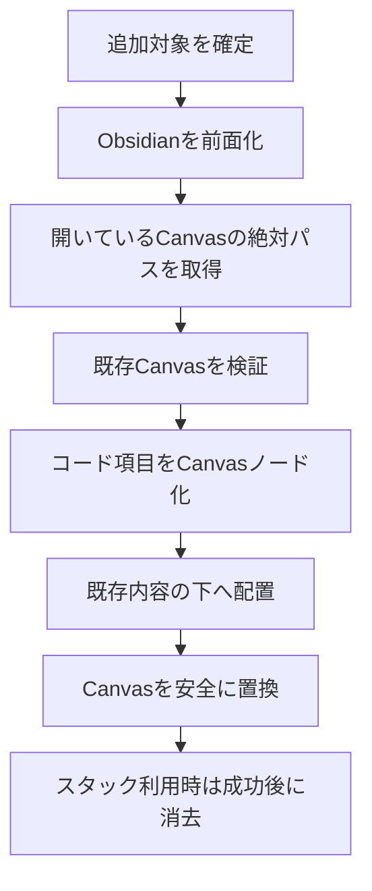
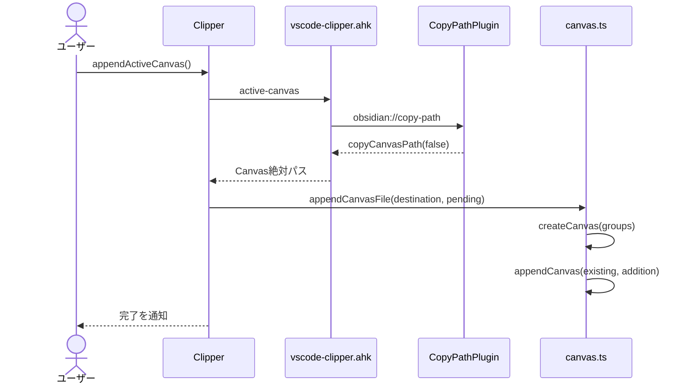

# アクティブObsidian Canvasへの追加

## 概要

単一の選択コードまたはスタック全体を、Obsidianで現在開いているCanvasの既存内容より下へ追記する。

## 動作フロー

## シーケンス

## 実装の構成

- **追加対象を確定する**
  - 単一選択は一項目のグループとし、スタック追加は現在の全グループを複製して処理中の対象を固定する。
  - [`src/extension.ts [333-349]`](vscode://sunb256.vscode-clipper/open?repo=vscode-clipper&path=src%2Fextension.ts&line=333) — `Clipper.clipAndAppend`
  - [`src/extension.ts [420-435]`](vscode://sunb256.vscode-clipper/open?repo=vscode-clipper&path=src%2Fextension.ts&line=420) — `Clipper.appendActiveCanvas`

- **アクティブCanvasのパスを要求する**
  - AutoHotkeyを起動し、Obsidian側で開かれているCanvasの絶対パスを標準出力から受け取る。
  - [`src/extension.ts [437-444]`](vscode://sunb256.vscode-clipper/open?repo=vscode-clipper&path=src%2Fextension.ts&line=437) — `Clipper.activeCanvasPath`
  - [`helper/vscode-clipper.ahk [46-67]`](vscode://sunb256.vscode-clipper/open?repo=vscode-clipper&path=helper%2Fvscode-clipper.ahk&line=46) — `CopyActiveCanvasPath`

- **Obsidianから実ファイル位置を返す**
  - プロトコルハンドラがアクティブファイルをCanvasかつローカルファイルと確認し、絶対パスをクリップボードへ書く。
  - [`public/obsidian-plugin/copy-path/src/main.ts [5-39]`](vscode://sunb256.vscode-clipper/open?repo=vscode-clipper&path=public%2Fobsidian-plugin%2Fcopy-path%2Fsrc%2Fmain.ts&line=5) — `CopyPathPlugin`

- **コード項目をCanvasへ配置する**
  - コード長と表示行数からノード寸法を求め、グループ構成に応じてテキストノードとグループ枠を生成する。
  - [`src/canvas.ts [33-80]`](vscode://sunb256.vscode-clipper/open?repo=vscode-clipper&path=src%2Fcanvas.ts&line=33) — `createCanvas`, `layoutGroup`
  - [`src/canvas.ts [82-123]`](vscode://sunb256.vscode-clipper/open?repo=vscode-clipper&path=src%2Fcanvas.ts&line=82) — `nodeWidth`, `nodeHeight`, `fencedCode`

- **既存内容の下へ追記する**
  - 既存Canvasの最下端と追加内容の最上端からオフセットを計算し、既存ノードとエッジを維持して結合する。
  - [`src/canvas.ts [142-166]`](vscode://sunb256.vscode-clipper/open?repo=vscode-clipper&path=src%2Fcanvas.ts&line=142) — `appendCanvas`, `appendCanvasFile`

- **成功後の状態を確定する**
  - スタック全件追加ではファイル更新成功後だけスタックを消去し、単一選択の直接追加ではスタックへ影響を与えない。
  - [`src/extension.ts [333-349]`](vscode://sunb256.vscode-clipper/open?repo=vscode-clipper&path=src%2Fextension.ts&line=333) — `Clipper.clipAndAppend`
  - [`src/extension.ts [420-435]`](vscode://sunb256.vscode-clipper/open?repo=vscode-clipper&path=src%2Fextension.ts&line=420) — `Clipper.appendActiveCanvas`

## 補足

アクティブCanvasの特定にはWindows上のAutoHotkeyと同梱のObsidian `copy-path`プラグインが必要である。
