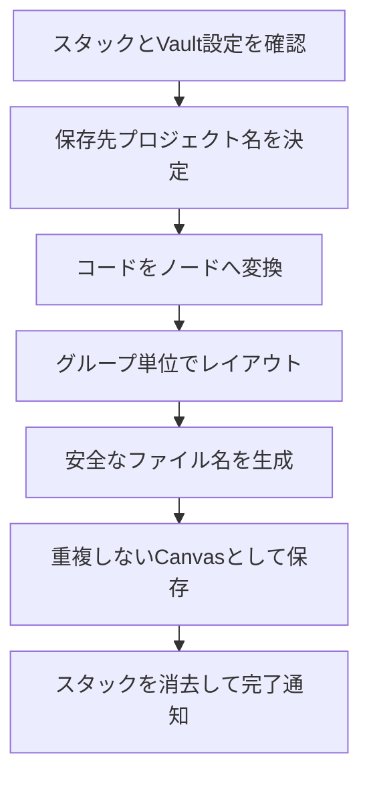
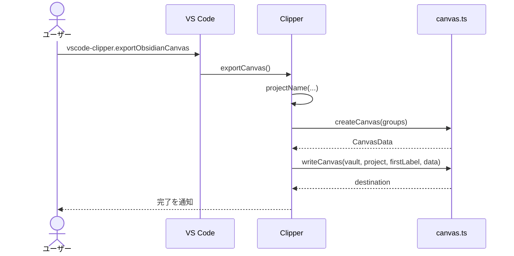

# 新規Obsidian Canvasの書き出し

## 概要

蓄積したコードグループを独立したObsidian Canvasへ変換し、設定済みVault内のプロジェクト別ディレクトリへ重複しない名前で保存する。

## 動作フロー

## シーケンス

## 実装の構成

- **出力条件を確認する**
  - 空でないスタックと存在するVault設定を確認し、ワークスペースまたは編集中ファイルからプロジェクト名を決める。
  - [`src/extension.ts [399-414]`](vscode://sunb256.vscode-clipper/open?repo=vscode-clipper&path=src%2Fextension.ts&line=399) — `Clipper.exportCanvas`
  - [`src/extension.ts [68-73]`](vscode://sunb256.vscode-clipper/open?repo=vscode-clipper&path=src%2Fextension.ts&line=68) — `projectName`

- **コードノードを組み立てる**
  - 各項目をパスラベルと安全なMarkdownコードフェンスを含むテキストノードへ変換する。
  - [`src/canvas.ts [55-80]`](vscode://sunb256.vscode-clipper/open?repo=vscode-clipper&path=src%2Fcanvas.ts&line=55) — `layoutGroup`
  - [`src/canvas.ts [118-123]`](vscode://sunb256.vscode-clipper/open?repo=vscode-clipper&path=src%2Fcanvas.ts&line=118) — `fencedCode`

- **ノード寸法を算出する**
  - 全角文字、タブ、折り返しを考慮してコードが収まる幅と高さを計算する。
  - [`src/canvas.ts [82-116]`](vscode://sunb256.vscode-clipper/open?repo=vscode-clipper&path=src%2Fcanvas.ts&line=82) — `nodeWidth`, `nodeHeight`

- **グループをレイアウトする**
  - 複数項目グループは二列のグループ枠に配置し、全グループが単一項目なら枠を省略する。
  - [`src/canvas.ts [33-80]`](vscode://sunb256.vscode-clipper/open?repo=vscode-clipper&path=src%2Fcanvas.ts&line=33) — `createCanvas`, `layoutGroup`

- **保存先と名前を安全化する**
  - Vaultの存在を検証し、プロジェクト名と最初の項目ラベルから予約文字を除いた保存先を組み立てる。
  - [`src/canvas.ts [125-140]`](vscode://sunb256.vscode-clipper/open?repo=vscode-clipper&path=src%2Fcanvas.ts&line=125) — `writeCanvas`
  - [`src/canvas.ts [189-206]`](vscode://sunb256.vscode-clipper/open?repo=vscode-clipper&path=src%2Fcanvas.ts&line=189) — `safeDirectory`, `canvasName`

- **重複を避けて保存する**
  - 一時ファイルを作成してからハードリンクを試し、既存名と衝突した場合は連番を付けて新規Canvasを確定する。
  - [`src/canvas.ts [208-225]`](vscode://sunb256.vscode-clipper/open?repo=vscode-clipper&path=src%2Fcanvas.ts&line=208) — `atomicWrite`

- **成功後にスタックを消去する**
  - Canvasの保存が完了してから元のグループを消去し、ステータスと通知を更新する。
  - [`src/extension.ts [412-417]`](vscode://sunb256.vscode-clipper/open?repo=vscode-clipper&path=src%2Fextension.ts&line=412) — `Clipper.exportCanvas`

## 補足

Canvasにはエッジを生成せず、同名ファイルがある場合は既存ファイルを上書きせずに`-2`以降の連番を付ける。
