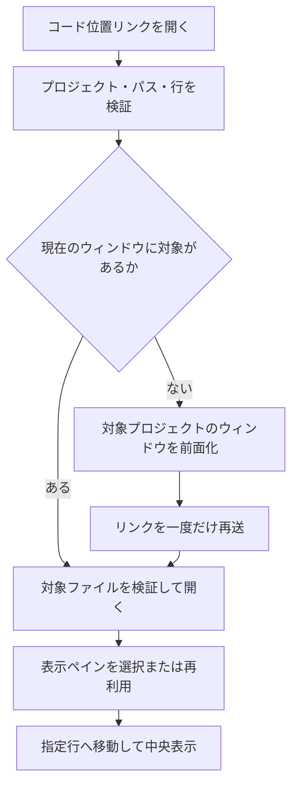
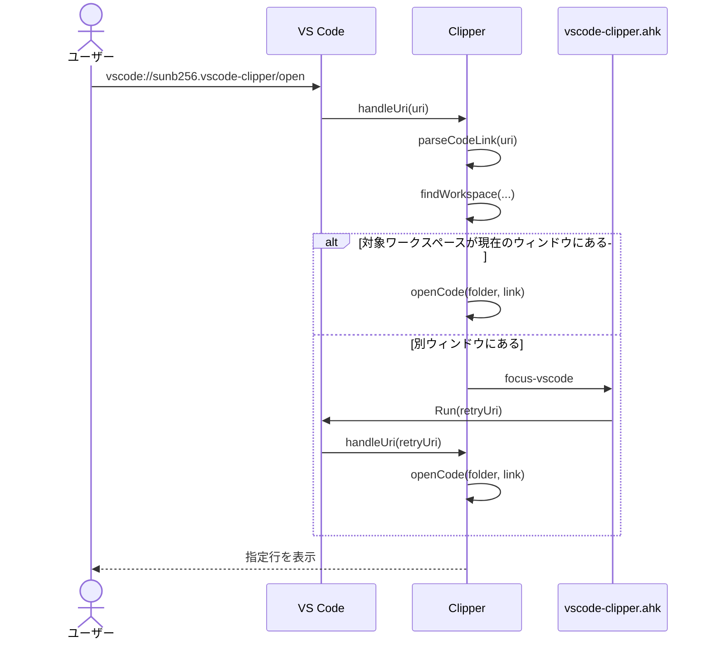

# コード位置リンクからのファイル表示

## 概要

MarkdownやObsidian上の専用`vscode:`リンクを受け取り、指定プロジェクトの対象ファイルと開始行を再利用可能なVS Codeペインへ表示する。

## 動作フロー

## シーケンス

## 実装の構成

- **URIハンドラを登録する**
  - 拡張機能の起動時に専用URIを`Clipper.handleUri`へ渡すハンドラをVS Codeへ登録する。
  - [`src/extension.ts [203-217]`](vscode://sunb256.vscode-clipper/open?repo=vscode-clipper&path=src%2Fextension.ts&line=203) — `Clipper.register`

- **リンク内容を検証する**
  - `/open`パスと必須クエリを読み取り、絶対パスやパストラバーサル、不正な行番号を拒否する。
  - [`src/extension.ts [38-66]`](vscode://sunb256.vscode-clipper/open?repo=vscode-clipper&path=src%2Fextension.ts&line=38) — `parseCodeLink`, `isSafeRelativePath`

- **対象ワークスペースを探す**
  - リンクのリポジトリ名と一致する現在のワークスペースフォルダを大文字・小文字を区別せず検索する。
  - [`src/extension.ts [52-59]`](vscode://sunb256.vscode-clipper/open?repo=vscode-clipper&path=src%2Fextension.ts&line=52) — `findWorkspace`
  - [`src/extension.ts [219-236]`](vscode://sunb256.vscode-clipper/open?repo=vscode-clipper&path=src%2Fextension.ts&line=219) — `Clipper.handleUri`

- **別ウィンドウへ引き渡す**
  - 対象が見つからない場合はプロジェクト名を含むVS Codeウィンドウを前面化し、再試行印付きURIを一度だけ送る。
  - [`src/extension.ts [227-233]`](vscode://sunb256.vscode-clipper/open?repo=vscode-clipper&path=src%2Fextension.ts&line=227) — `Clipper.handleUri`
  - [`helper/vscode-clipper.ahk [25-44]`](vscode://sunb256.vscode-clipper/open?repo=vscode-clipper&path=helper%2Fvscode-clipper.ahk&line=25) — `FocusVscode`, `FindVscodeWindow`

- **表示ペインを決定する**
  - 設定に従って現在のペインまたは左側の再利用可能なコード表示ペインを選ぶ。
  - [`src/extension.ts [27-36]`](vscode://sunb256.vscode-clipper/open?repo=vscode-clipper&path=src%2Fextension.ts&line=27) — `codeLinkColumn`
  - [`src/extension.ts [249-267]`](vscode://sunb256.vscode-clipper/open?repo=vscode-clipper&path=src%2Fextension.ts&line=249) — `Clipper.openCode`

- **ファイルと行を表示する**
  - 対象ファイルの存在と行範囲を確認してプレビュー表示し、カーソルと表示領域を指定行へ移動する。
  - [`src/extension.ts [238-270]`](vscode://sunb256.vscode-clipper/open?repo=vscode-clipper&path=src%2Fextension.ts&line=238) — `Clipper.openCode`

## 補足

別ウィンドウへの切り替えはWindows限定で、対象プロジェクトを開いたVS Codeウィンドウのタイトルにリポジトリ名が含まれる必要がある。
