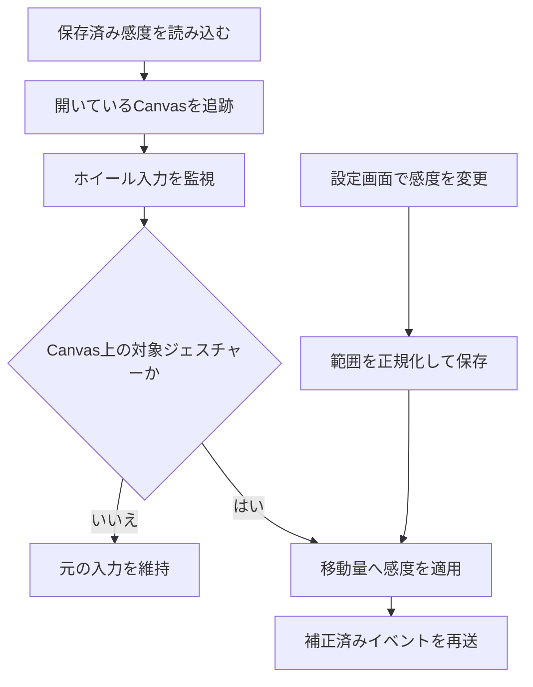
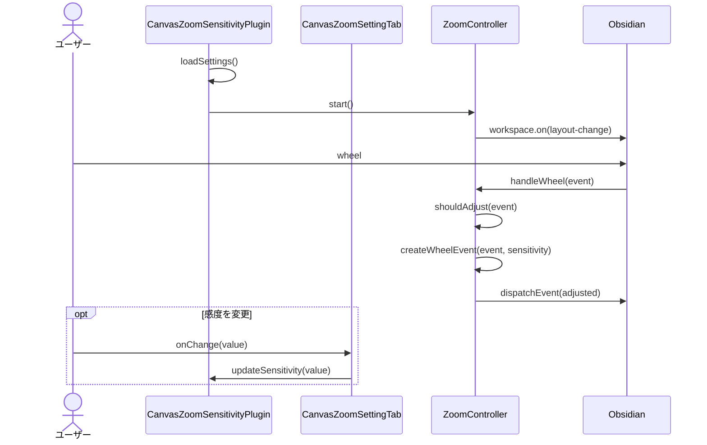

# Obsidian Canvasのズーム感度調整

## 概要

Obsidian Canvas上のホイール入力だけを対象に移動量を設定倍率で補正し、標準より緩やかなズーム操作を提供する。

## 動作フロー

## シーケンス

## 実装の構成

- **感度設定を読み込む**
  - プラグイン起動時に保存値を既定値へ重ね、許容範囲へ正規化してコントローラへ提供する。
  - [`public/obsidian-plugin/canvas-zoom-sensitivity/src/main.ts [10-37]`](vscode://sunb256.vscode-clipper/open?repo=vscode-clipper&path=public%2Fobsidian-plugin%2Fcanvas-zoom-sensitivity%2Fsrc%2Fmain.ts&line=10) — `CanvasZoomSensitivityPlugin`
  - [`public/obsidian-plugin/canvas-zoom-sensitivity/src/settings.ts [8-18]`](vscode://sunb256.vscode-clipper/open?repo=vscode-clipper&path=public%2Fobsidian-plugin%2Fcanvas-zoom-sensitivity%2Fsrc%2Fsettings.ts&line=8) — `DEFAULT_SETTINGS`, `normalizeSensitivity`

- **Canvas表示領域を追跡する**
  - 起動時とレイアウト変更時にCanvasビューを列挙し、対象DOMとウィンドウを監視対象へ登録する。
  - [`public/obsidian-plugin/canvas-zoom-sensitivity/src/zoom-controller.ts [17-55]`](vscode://sunb256.vscode-clipper/open?repo=vscode-clipper&path=public%2Fobsidian-plugin%2Fcanvas-zoom-sensitivity%2Fsrc%2Fzoom-controller.ts&line=17) — `ZoomController.start`, `ZoomController.refreshCanvasRoots`

- **対象ジェスチャーを判定する**
  - Canvas内のホイール入力を認識し、修飾キー付き操作と再送イベントを除外する。
  - [`public/obsidian-plugin/canvas-zoom-sensitivity/src/zoom-controller.ts [58-96]`](vscode://sunb256.vscode-clipper/open?repo=vscode-clipper&path=public%2Fobsidian-plugin%2Fcanvas-zoom-sensitivity%2Fsrc%2Fzoom-controller.ts&line=58) — `ZoomController.handleWheel`, `ZoomController.shouldAdjust`

- **ホイール量を補正する**
  - 元イベントの属性を保ったまま`deltaY`へ感度倍率を掛けた合成イベントを生成する。
  - [`public/obsidian-plugin/canvas-zoom-sensitivity/src/zoom-controller.ts [98-124]`](vscode://sunb256.vscode-clipper/open?repo=vscode-clipper&path=public%2Fobsidian-plugin%2Fcanvas-zoom-sensitivity%2Fsrc%2Fzoom-controller.ts&line=98) — `ZoomController.createWheelEvent`

- **補正イベントをCanvasへ渡す**
  - 元イベントを停止し、循環処理を防ぐ印を付けた補正済みイベントを同じ対象へ再送する。
  - [`public/obsidian-plugin/canvas-zoom-sensitivity/src/zoom-controller.ts [58-76]`](vscode://sunb256.vscode-clipper/open?repo=vscode-clipper&path=public%2Fobsidian-plugin%2Fcanvas-zoom-sensitivity%2Fsrc%2Fzoom-controller.ts&line=58) — `ZoomController.handleWheel`

- **利用者の感度変更を保存する**
  - 設定タブのスライダー値をプラグインへ渡し、0.05から1.00の範囲へ正規化して永続化する。
  - [`public/obsidian-plugin/canvas-zoom-sensitivity/src/settings.ts [20-41]`](vscode://sunb256.vscode-clipper/open?repo=vscode-clipper&path=public%2Fobsidian-plugin%2Fcanvas-zoom-sensitivity%2Fsrc%2Fsettings.ts&line=20) — `CanvasZoomSettingTab.display`
  - [`public/obsidian-plugin/canvas-zoom-sensitivity/src/main.ts [25-28]`](vscode://sunb256.vscode-clipper/open?repo=vscode-clipper&path=public%2Fobsidian-plugin%2Fcanvas-zoom-sensitivity%2Fsrc%2Fmain.ts&line=25) — `CanvasZoomSensitivityPlugin.updateSensitivity`

## 補足

感度が1の場合または先行処理で既にキャンセルされたイベントは変更せず、Ctrlはトラックパッドのピンチズーム互換のため許可される。
