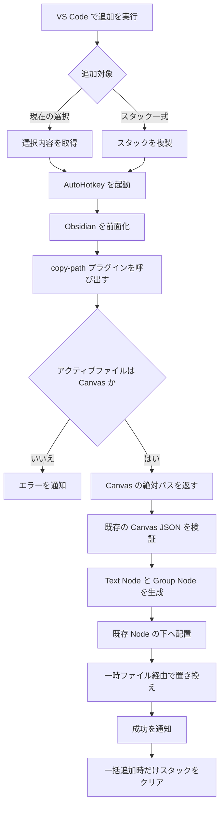
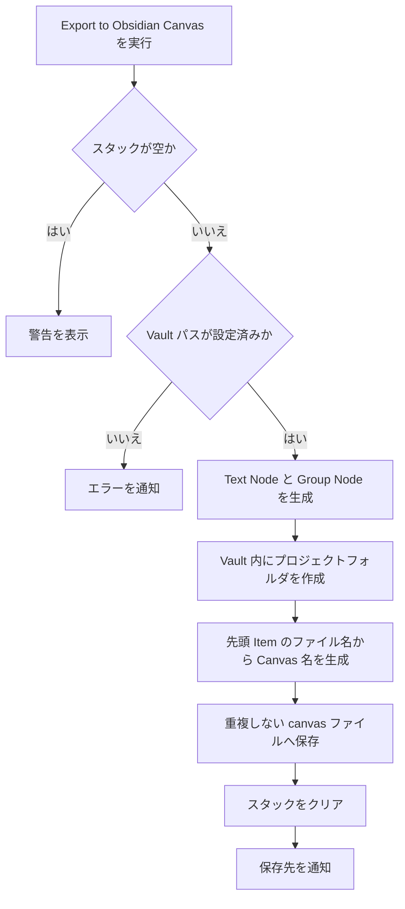
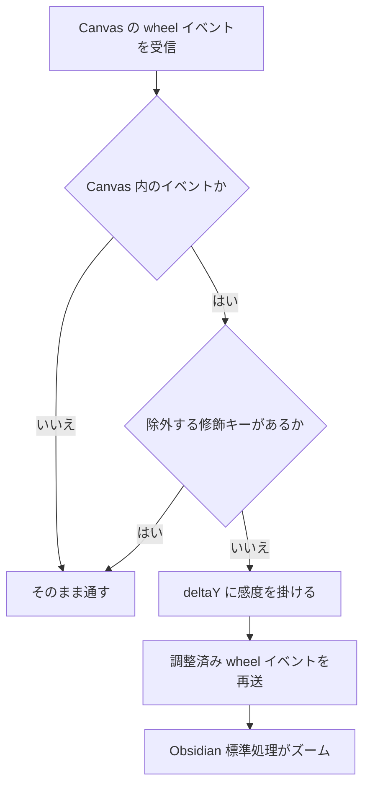

# Obsidian Canvas 動作フロー

## アクティブな Canvas への追記

```mermaid
%%{init: {'flowchart': {'nodeSpacing': 20, 'rankSpacing': 30}}}%%

flowchart TD
    A["VS Code で追加を実行"] --> B{"追加対象"}
    B -->|"現在の選択"| C["選択内容を取得"]
    B -->|"スタック一式"| D["スタックを複製"]
    C --> E["AutoHotkey を起動"]
    D --> E
    E --> F["Obsidian を前面化"]
    F --> G["copy-path プラグインを呼び出す"]
    G --> H{"アクティブファイルは Canvas か"}
    H -->|"いいえ"| I["エラーを通知"]
    H -->|"はい"| J["Canvas の絶対パスを返す"]
    J --> K["既存の Canvas JSON を検証"]
    K --> L["Text Node と Group Node を生成"]
    L --> M["既存 Node の下へ配置"]
    M --> N["一時ファイル経由で置き換え"]
    N --> O["成功を通知"]
    O --> P["一括追加時だけスタックをクリア"]
```

## 新規 Canvas への書き出し

```mermaid
%%{init: {'flowchart': {'nodeSpacing': 20, 'rankSpacing': 30}}}%%

flowchart TD
    A["Export to Obsidian Canvas を実行"] --> B{"スタックが空か"}
    B -->|"はい"| C["警告を表示"]
    B -->|"いいえ"| D{"Vault パスが設定済みか"}
    D -->|"いいえ"| E["エラーを通知"]
    D -->|"はい"| F["Text Node と Group Node を生成"]
    F --> G["Vault 内にプロジェクトフォルダを作成"]
    G --> H["先頭 Item のファイル名から Canvas 名を生成"]
    H --> I["重複しない canvas ファイルへ保存"]
    I --> J["スタックをクリア"]
    J --> K["保存先を通知"]
```

## Canvas ズーム感度の調整

```mermaid
%%{init: {'flowchart': {'nodeSpacing': 20, 'rankSpacing': 30}}}%%

flowchart TD
    A["Canvas の wheel イベントを受信"] --> B{"Canvas 内のイベントか"}
    B -->|"いいえ"| C["そのまま通す"]
    B -->|"はい"| D{"除外する修飾キーがあるか"}
    D -->|"はい"| C
    D -->|"いいえ"| E["deltaY に感度を掛ける"]
    E --> F["調整済み wheel イベントを再送"]
    F --> G["Obsidian 標準処理がズーム"]
```
