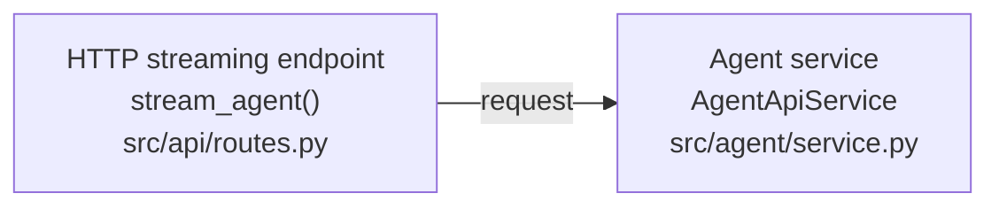

# Goal

Create a compact, evidence-based mental model of one specific feature in the current codebase.

The Mermaid diagram is a map for reading the real code, not a substitute for reading it. Optimize for helping a human understand the feature and then inspect the relevant implementation.

# Input

Treat the user's requested feature or behavior as the investigation target.

Examples:

- "会話メッセージを受け取り、Agentを実行してstreaming responseを返す機能"
- "ログインしてセッションを生成する処理"
- "Tool Callを受けて実行結果をLLMへ戻す処理"
- "定期タスクがDBから取得されて実行されるまで"

If the request is broad, choose the narrowest coherent end-to-end flow that answers it and state the chosen scope.

Do not ask a clarification question unless multiple interpretations would produce materially different code paths and the repository does not resolve the ambiguity.

# Investigation workflow

1. Read repository-level instructions such as `AGENTS.md` when present.
2. Inspect the repository structure enough to identify likely entry points.
3. Search for the requested behavior using routes, event names, classes, functions, types, configuration keys, and user-visible terminology.
4. Find the real entry point and trace the execution/data path through the code.
5. Follow important calls across files until the requested behavior reaches its meaningful endpoint.
6. Check important branches such as persistence, tool execution, streaming/event emission, queues, external services, and error paths when they materially affect the requested feature.
7. Distinguish:
   - **Verified**: directly supported by code inspected.
   - **Inferred**: strongly suggested by code, but the exact runtime path could not be fully verified.
   - **Unknown**: insufficient evidence.
8. Reduce the verified flow to **8–15 major nodes**.
9. Generate a Mermaid flowchart that a human can import into draw.io and then annotate with real code snippets.
10. Review the diagram against the inspected code before returning it.

# Abstraction rules

Prefer nodes that represent meaningful responsibilities or boundaries:

- UI / caller
- HTTP or message entry point
- request parsing / validation
- application service
- agent / orchestrator
- LLM call
- tool execution
- streaming/event encoder
- persistence/session store
- external service
- response boundary

Do **not** create a node for every function, helper, DTO, or utility.

If the real flow requires more than 15 nodes, collapse low-level implementation details into a higher-level component. If collapsing would make the diagram misleading, split the explanation conceptually but keep the primary diagram within 8–15 nodes.

# Evidence rules

Every node and important edge must be grounded in inspected repository code.

Do not infer a call solely because two classes or files have related names.

For each important transition, verify at least one of the following when applicable:

- direct function or method call
- constructor/injected dependency usage
- route-to-handler binding
- event producer/consumer relationship
- queue publication/consumption
- database read/write
- imported symbol usage
- callback registration
- framework wiring/configuration
- returned/yielded value passed to the next component

When dynamic dispatch, dependency injection, plugins, callbacks, or framework magic prevent full verification, mark that part as inferred instead of presenting it as fact.

# Mermaid rules

Use Mermaid `flowchart LR` by default. Use `flowchart TD` only when the flow is much clearer vertically.

Keep Mermaid compatible with draw.io:

- use ordinary nodes and edges
- avoid custom themes and elaborate styling
- avoid unnecessary `classDef`
- avoid decorative icons
- keep labels short
- use `<br/>` for line breaks inside node labels

Each node should normally contain:

1. responsibility/component name
2. important symbol when useful
3. repository-relative file path

Example:



Always use **repository-relative paths**, never absolute paths.

Use edge labels for important data or events rather than generic labels such as "calls":

```mermaid
A -->|"ChatRequest"| B
B -->|"RunStarted / text chunks"| C
```

Use a dashed edge for a materially important relationship that is inferred rather than fully verified:

```mermaid
A -.->|"inferred"| B
```

Do not put line numbers inside Mermaid nodes because they make the visual noisy and become stale quickly.

# What to emphasize

Prioritize **data movement and execution responsibility**.

The diagram should help answer:

- Where does the feature start?
- What data enters?
- Which component owns each major step?
- Where does the data change form?
- Where are LLM/tools/DB/external systems involved?
- What is streamed, returned, persisted, or emitted?
- Where does the feature end?

Avoid turning the diagram into a static dependency graph unless dependency structure is itself the requested feature.

# Output format

Return the following sections in this exact order.

## Scope

In 1–3 sentences, state what concrete behavior was traced and where the flow starts and ends.

## Mermaid

Put the Mermaid diagram immediately after the scope so it can be copied directly into draw.io.

The primary diagram must contain **8–15 nodes**.

## Evidence

Use a compact table:

| Node / transition | Relative path | Symbol / evidence | Status |
|---|---|---|---|
| ... | `src/...` | `Class.method()` or concise evidence | Verified |

Include enough evidence to let the user jump from the diagram to the actual code. Do not enumerate every helper.

## Inferences / unknowns

Only include this section when something important could not be fully verified.

State exactly what is inferred or unknown and why.

Do not hide uncertainty inside confident prose.

## Recommended reading order

Give a short ordered list of the **3–7 most useful files/symbols to read next**.

Order them according to the execution flow, not alphabetically.

For each item, give one sentence explaining what understanding it adds.

# Quality checks

Before responding, verify:

- The diagram describes the requested feature, not the whole repository.
- It contains 8–15 major nodes.
- Every node has a repository-relative path when a corresponding file exists.
- Major edges represent real data/control movement.
- Functions are not exhaustively enumerated.
- Unverified claims are marked as inferred or unknown.
- The output can be copied into draw.io without cleanup-heavy Mermaid styling.
- A human can use the diagram as a map and then attach real code snippets beside the relevant nodes.

# Behavior to avoid

Do not:

- generate a diagram from filenames alone
- invent architecture that "probably" exists
- describe an ideal implementation instead of the current implementation
- over-explain framework basics unless necessary to understand this feature
- produce a giant repository-wide architecture diagram
- use 20+ tiny nodes to appear comprehensive
- hide uncertainty
- modify code unless the user explicitly asks for code changes

The primary objective is an accurate, compact mental model of the existing feature.
