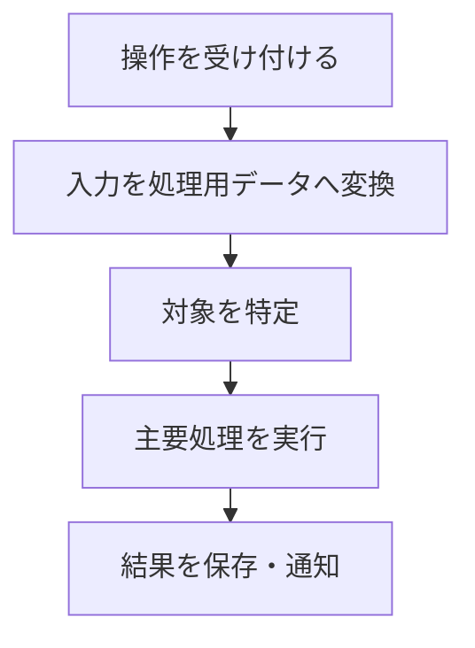

# <機能名>

## 概要

この機能が何を入力として、何を実現するかを1〜2文で記述する。

## 動作フロー

<!-- 入口または結果が大きく異なる場合だけ、別フローを追加する。 -->

## 実装の構成

- **操作を受け付ける**：ユーザー操作を受け取り、機能の処理を開始する。
  - [`src/example.ts [10-20]`](vscode://sunb256.vscode-clipper/open?repo=example-project&path=src%2Fexample.ts&line=10) — `registerCommand`

- **入力を処理用データへ変換する**：入力値を後続処理で扱うデータ構造へまとめる。
  - [`src/example.ts [120-130]`](vscode://sunb256.vscode-clipper/open?repo=example-project&path=src%2Fexample.ts&line=120) — `createInput`

- **主要処理を実行する**：対象データに対して、この機能の中心となる処理を行う。
  - [`src/service.ts [5-10]`](vscode://sunb256.vscode-clipper/open?repo=example-project&path=src%2Fservice.ts&line=5) — `Service.run`

## 補足

<!-- 重要な前提条件、分岐、または未確認事項がある場合だけ残す。なければ節ごと削除する。 -->
